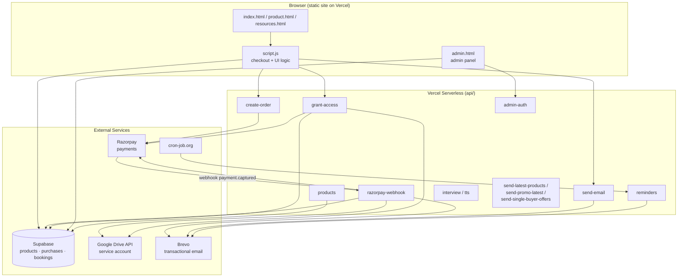
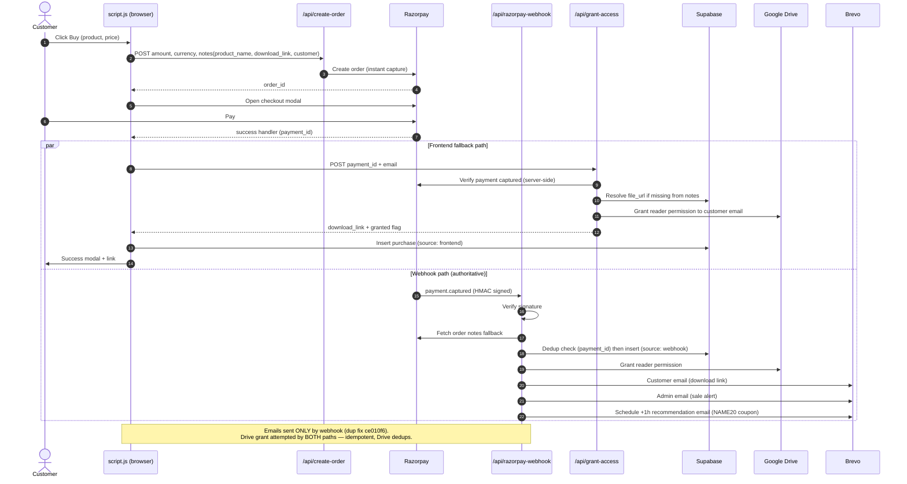
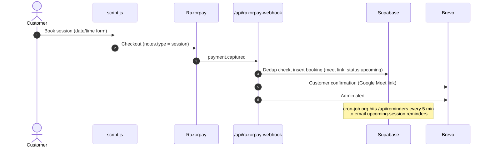

# Desk2Quant — Architecture & Dynamic Flows

## System Overview



## Purchase Flow (dynamic, current — post-fix)



## Session Booking Flow



## Drive Access Model

```
Product file (Google Drive, restricted)
  owner:  amitjha20250305@gmail.com
  writer: drive-sharing-service@desk2quant.iam.gserviceaccount.com  ← service account (Editor)
  reader: <each customer email, granted per purchase>

Grant paths (both idempotent):
  1. Webhook  → grantDrivePermission()      — authoritative
  2. Frontend → POST /api/grant-access      — fallback if webhook dead
     (verifies payment with Razorpay first — cannot be spoofed)
```

## Data Stores (Supabase)

| Table | Written by | Key fields |
|---|---|---|
| products | admin panel | name, price, file_url, coupon_code |
| purchases | webhook + frontend (dedup on payment_id + source) | payment_id, source, download_link, customer_email |
| bookings | webhook | payment_id, booking_date, meet_link, status |

## Env Vars (Vercel)

`RAZORPAY_KEY_ID/SECRET`, `RAZORPAY_WEBHOOK_SECRET`, `GOOGLE_SERVICE_ACCOUNT_EMAIL`, `GOOGLE_PRIVATE_KEY`, `BREVO_API_KEY`, `SUPABASE_URL/KEY`, `ADMIN_EMAIL`, `SENDER_EMAIL/NAME`

## Constraints

- Vercel Hobby: max 12 serverless functions (currently exactly 12; archive/ holds retired ones)
- Cheatcode product: dead Drive file ID in Supabase — pending new link
```
